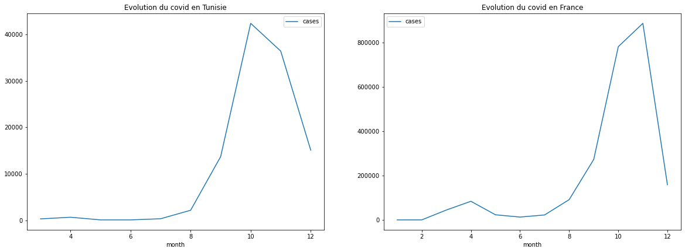
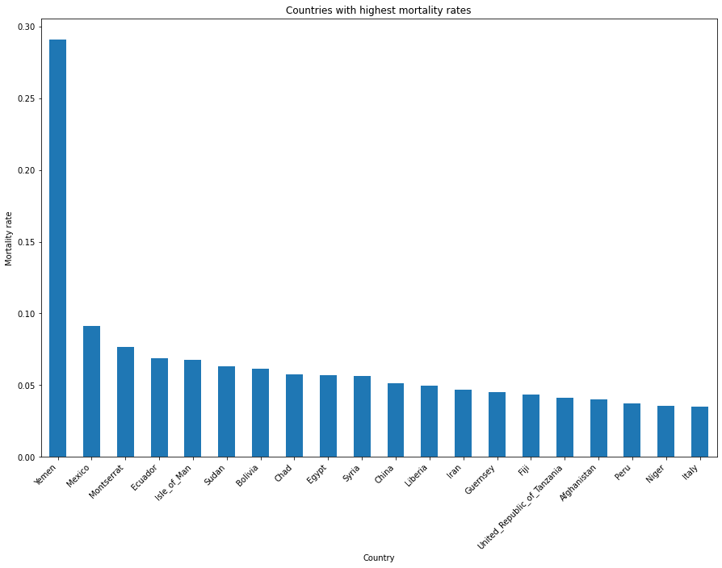
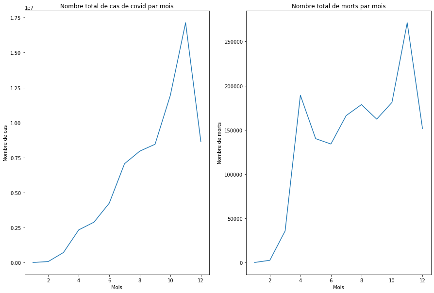
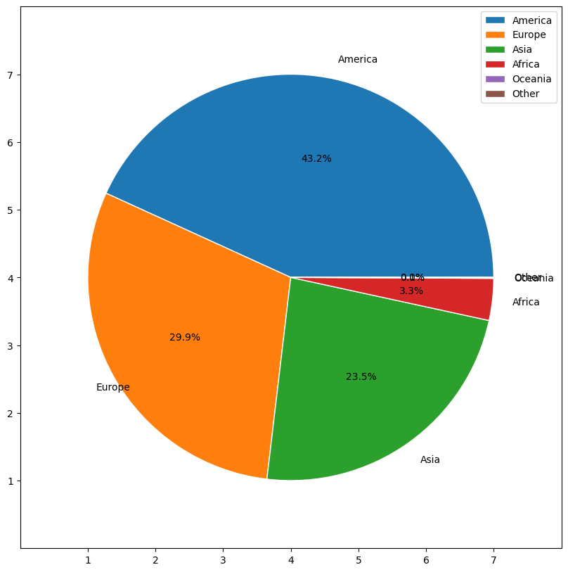
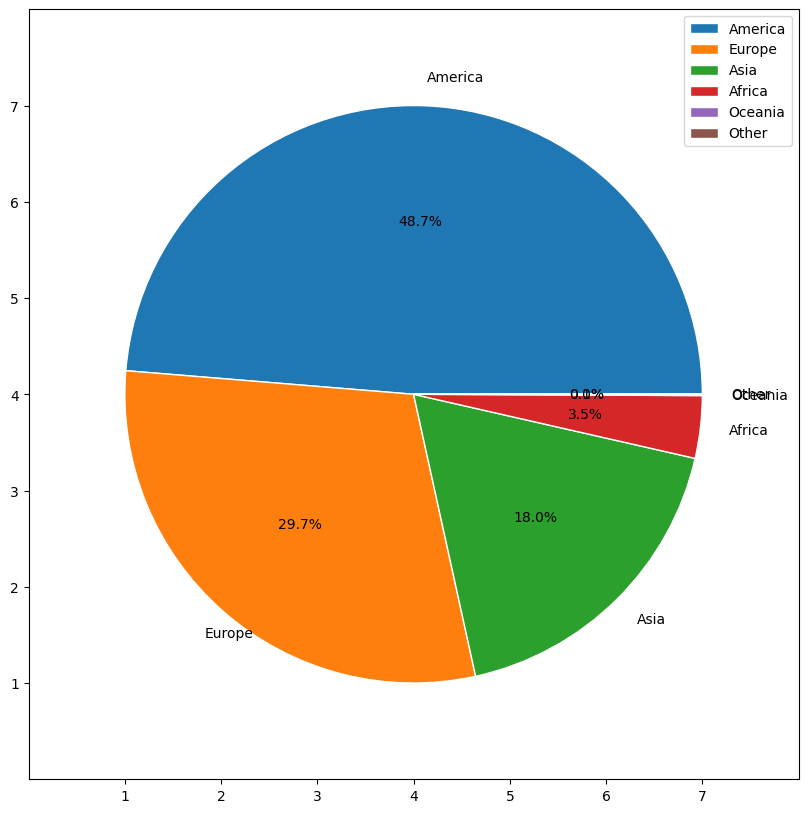

# Covid-Data-Explorations

  

**Table of Contenst :**

- [Dataset :](#dataset-)
  - [Overview](#overview)
  - [Data Dictionary :](#data-dictionary-)
- [Data Exploration :](#data-exploration-)
  - [🗺️ **Explore**:](#️-explore)
  - [🔎 **Analyze** :](#-analyze-)
  - [📊 **Visualize** :](#-visualize-)

# Dataset :

This is a covid-19 dataset that provides information on covid geographic distribution worldwide in 2020

## Overview

The Covid-19 dataset contains detailed information on number of cases, number of death and dates regrouped by countries in 2020

| | dateRep | day | month | year | cases | deaths | countriesAndTerritories | geoId | countryterritoryCode | popData2019 | continentExp | Cumulative_number_for_14_days_of_COVID-19_cases_per_100000 |
|---|--------------------|------|--------|-------|--------|---------|--------------------------|--------|-----------------------|--------------|---------------|-------------------------------------------------------------|
|0 | 2020-12-14 00:00:00 | 14 | 12 | 2020 | 746 | 6 | Afghanistan | AF | AFG | 3.80418e+07 | Asia | 9.01378 |
| 1 | 2020-12-13 00:00:00 | 13 | 12 | 2020 | 298 | 9 | Afghanistan | AF | AFG | 3.80418e+07 | Asia | 7.05278 |
| 2 | 2020-12-12 00:00:00 | 12 | 12 | 2020 | 113 | 11 | Afghanistan | AF | AFG | 3.80418e+07 | Asia | 6.86877 |
| 3 | 2020-12-11 00:00:00 | 11 | 12 | 2020 | 63 | 10 | Afghanistan | AF | AFG | 3.80418e+07 | Asia | 7.13427 |
| 4 | 2020-12-10 00:00:00 | 10 | 12 | 2020 | 202 | 16 | Afghanistan | AF | AFG | 3.80418e+07 | Asia | 6.96866 |

 ## Data Dictionary :
 | Column | Explanation                    |
| ------ | ------------------------------ |
| dateRep| Report date |
| day   | Report day                 |
| month    | Report month                         |
| year    | Report year           |
| cases | number of cases              |
| deaths | number of deaths                  |
| countriesAndTerritories   | Country or Territorie   |
| geoId    | geographical identifier  |
| countryterritoryCode  | country code               |
| continentExp   | continent          |
| Cumulative_number_for_14_days_of_COVID-19_cases_per_100000 | Cumulative number for 14 days of COVID-19 cases per 100000              |

[Source](https://www.ecdc.europa.eu/en/publications-data/download-todays-data-geographic-distribution-covid-19-cases-worldwide) of the dataset.

# Data Exploration : 
  ## 🗺️ **Explore**: 
 1/ Which are the countries with the highest number of covid-19 cases in 2020

  | countriesAndTerritories   |       cases |   deaths |
  |:--------------------------|------------:|---------:| 
  |United_States_of_America  | 1.62568e+07 |   299177 |
  | India                     | 9.8841e+06  |   143355 |
  | Brazil                    | 6.90195e+06 |   181402 |
  | Russia                    | 2.65393e+06 |    46941 |
  | France                    | 2.37685e+06 |    57911 |

  2/ Which countries have a high death rate

  | countriesAndTerritories   |       cases |   deaths |   mortality_rate |
  |:--------------------------|------------:|---------:|-----------------:|
  | United_States_of_America  | 1.62568e+07 |   299177 |        0.0184032 |
  | India                     | 9.8841e+06  |   143355 |        0.0145036 |
  | Brazil                    | 6.90195e+06 |   181402 |        0.0262827 |
  | Russia                    | 2.65393e+06 |    46941 |        0.0176874 |
  | France                    | 2.37685e+06 |    57911 |        0.0243646 |

 3/ What is the effect of containment on the number of cases
 |   month |            cases |   deaths |
 |--------:|-----------------:|---------:|
 |       1 |   9799           |      213 |
 |       2 |  75422           |     2708 |
 |       3 | 723738           |    35814 |
 |       4 |      2.33959e+06 |   189180 |
 |       5 |      2.892e+06   |   140142 |
 |       6 |      4.24952e+06 |   134069 |
 |       7 |      7.06752e+06 |   166195 |
 |       8 |      7.96384e+06 |   178618 |
 |       9 |      8.45625e+06 |   162169 |
 |      10 |      1.1949e+07  |   181054 |
 |      11 |      1.7134e+07  |   271086 |
 |      12 |      8.64286e+06 |   151585 |

  ## 🔎 **Analyze** :
 
 1/ Continent that has the highest number of cases

  Europe     17372
  Africa     14981
  America    13742
  Asia       13241
  Oceania     2500
  Other         64
  Name: continentExp, dtype: int64

2/ Sum for each continent sorted by case
  | continentExp   |           cases |   deaths |
  |:---------------|----------------:|---------:|
  | America        |     3.08876e+07 |   785420 |
  | Europe         |     2.14e+07    |   479789 |
  | Asia           |     1.6782e+07  |   290129 |
  | Africa         |     2.37983e+06 |    56334 |
  | Oceania        | 53440           |     1154 |
  | Other          |   696           |        7 |

  3/ Sum for each continent sorted by number of dead

  | continentExp   |           cases |   deaths |
  |:---------------|----------------:|---------:|
  | America        |     3.08876e+07 |   785420 |
  | Europe         |     2.14e+07    |   479789 |
  | Asia           |     1.6782e+07  |   290129 |
  | Africa         |     2.37983e+06 |    56334 |
  | Oceania        | 53440           |     1154 |
  | Other          |   696           |        7 |

  4 / Death rate in each continent

  | continentExp   |           cases |   deaths |   moratlity_rate |
  |:---------------|----------------:|---------:|-----------------:|
  | America        |     3.08876e+07 |   785420 |        0.0254283 |
  | Africa         |     2.37983e+06 |    56334 |        0.0236715 |
  | Europe         |     2.14e+07    |   479789 |        0.02242   |
  | Oceania        | 53440           |     1154 |        0.0215943 |
  | Asia           |     1.6782e+07  |   290129 |        0.0172881 |
  | Other          |   696           |        7 |        0.0100575 |
  ## 📊 **Visualize** : 
  
1/ Comparison between the evolution of covid in France and in tunisia

2/ Countries with highest mortality rates

3/ Number of cases per month and number of deaths per month 

4/ continents with the highest number of cases

4/continents with the highest death toll

 

